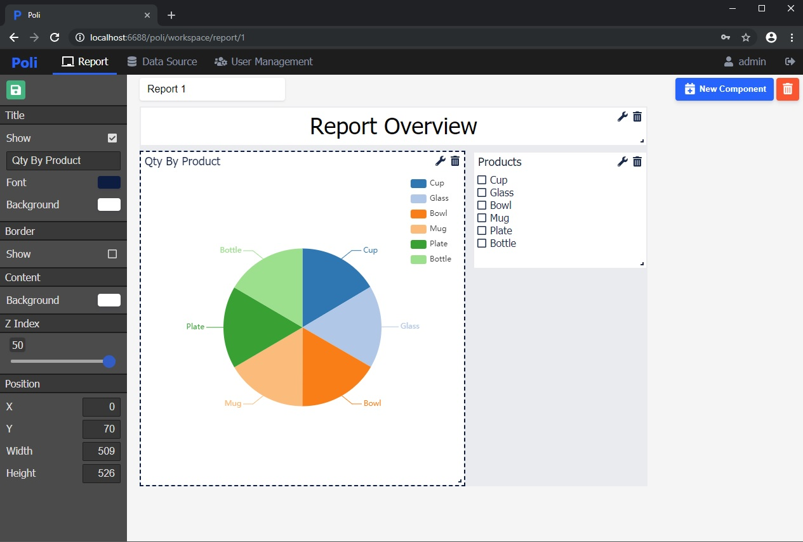
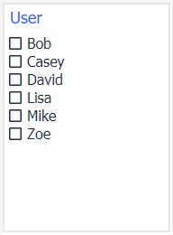
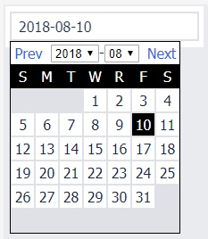
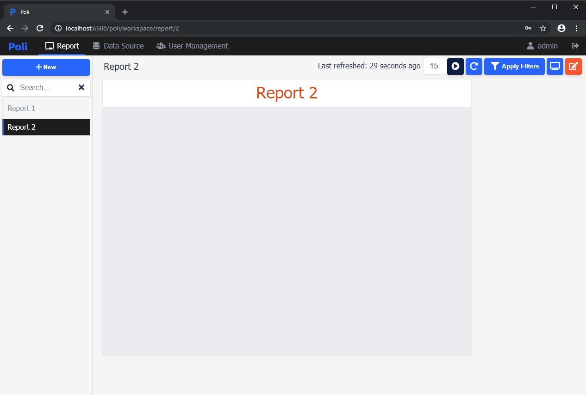
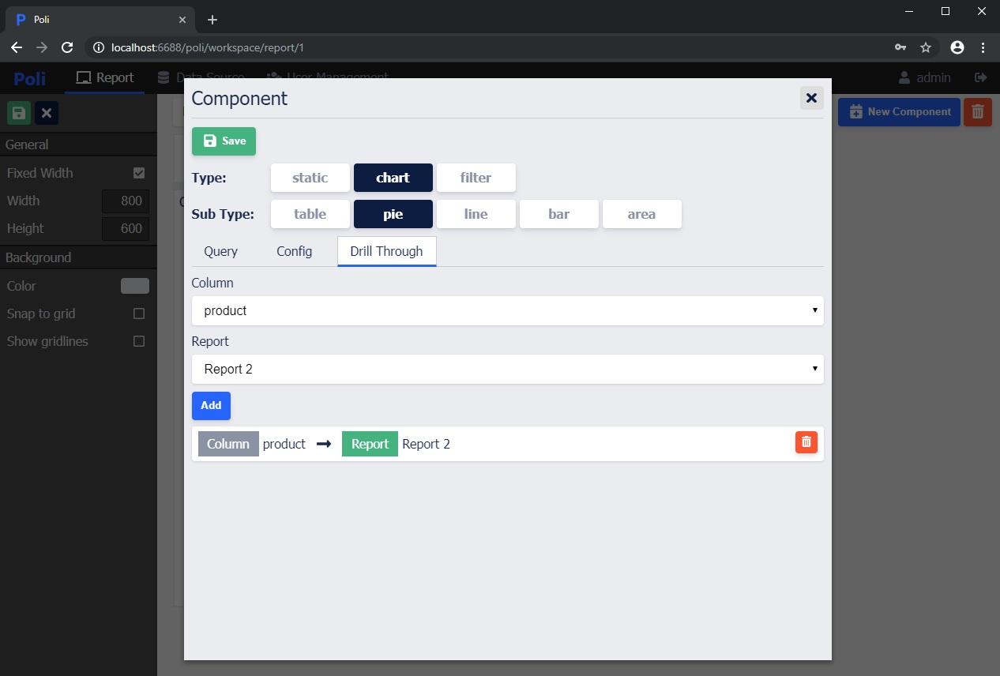
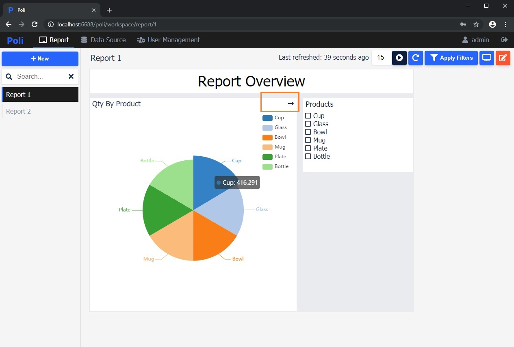
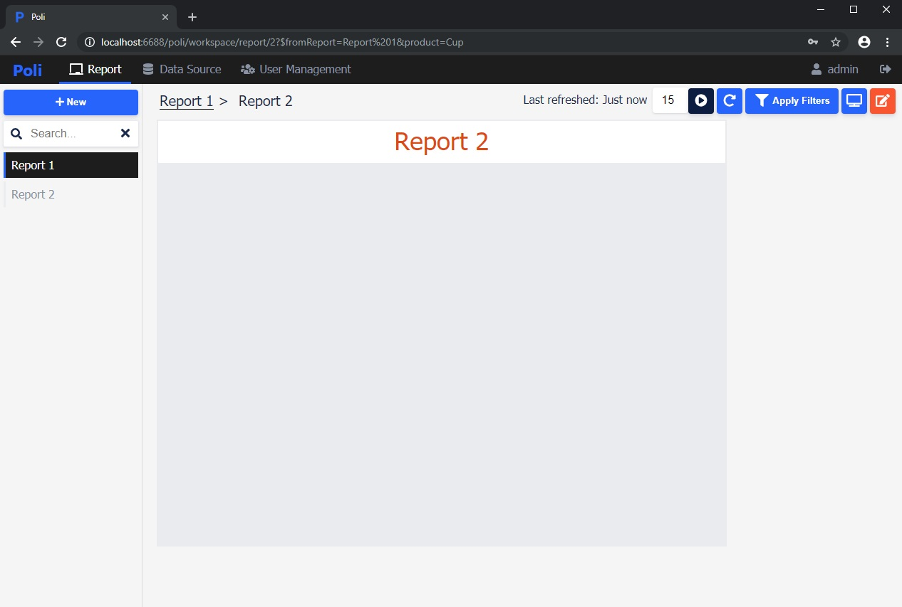
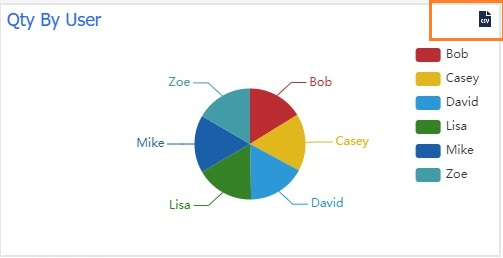

# Report Component

## Style customization

* Title
* Position (x, y, width, height, z Index)

  Components can be repositioned and resized on the report. If you'd like to stack/overlap components, z index field can be used to control the stacking order.

* Border
* Content background color 

> After modifying the style, don't forget to click the save button to save the changes.



## Types

Poli supports three types of components.

* Static
  * Text
  * Image
  * Iframe
  * Html

* Chart
  * Table
  * Pie
    
    > Pie chart requires the query to return at least two columns.

  * Bar
  * Line
  * Area

    > Bar/Line/Area charts support multi-series data.

* Filter
  * Slicer

    Slicer provides a list of values to select. 

    

    It requires the query to return one column only.

    ```sql
    SELECT user_id 
    FROM trans 
    GROUP BY user_id 
    ORDER BY user_id;
    ```
  
  * Single value

  * Date picker

    The default format is yyyy-MM-dd. For example, 2018-08-10. 

    
    
    Example to use the query parameters in a query.

    ```sql
    SELECT * FROM TRANSACTIONS
    WHERE 1 = 1
    {{ AND created_date > :start_date }}
    {{ AND created_date <= :end_date }}
    ORDER BY created_date ASC;
    ```

## Dynamic SQL query with parameters

To use this feature, you would need to create at least one filter and one chart component. Here is how it works.

1. Create a filter and define a query parameter. The query parameter serves as a placeholder for a real value in the query string. 
2. Create a chart and use the query parameter from the fitler in the SQL query.
3. Enter/Select the value in the filter and click apply filter button to see the chart data change accordingly.

For example:

Create a Slicer filter and define username as query parameter.
```sql
-- Slicer
SELECT username FROM user GROUP BY username;
```

Create a Table chart and use the :username in the IN clause.
```sql
-- Table
SELECT * FROM user WHERE 1 = 1 {{ AND username IN (:username) }}
```

More dynamic query examples:

```sql
-- Query parameter from Slicer
SELECT * FROM user WHERE 1 = 1 {{ AND name IN (:name) }}

-- Query parameter from Single value
SELECT * FROM user WHERE 1 = 1 {{ AND name = :name }}

-- More
SELECT * 
FROM user 
WHERE 1 = 1 
{{ AND department IN (:department) }}
{{ AND role = :role }}
{{ AND created <= :created }}
ORDER BY last_login DESC
```

Nested parameters are not supported. For example:

```sql
-- Invalid
SELECT * 
FROM user 
WHERE 1 = 1 
{{ 
    AND department IN (:department) 
    {{ AND role = :role }}
}}
```

## Drill through

1. Drill through is used to navigate from one component in a Report to another Report. To use it in Poli, you need to have at least two reports.



2. Create a pie chart in Report 1. Go to Drill Through tab. Choose the source column and destination report.



3. Click the Cup piece on the pie chart.

> If this component has drill through defined, there will be a --> icon on the title bar.



4. Report 2 is being displayed and product=Cup is passed along to Report 2. If there are any chart components on Report 2 that use :product query parameter in the query will become reactive.



## Access permissions

Reports can be edited by Admin/Developer users, associated with a Group and viewed by all users. Check [User Management](/user-management) for more details.

## Export CSV

Click export button at the top right corner of the chart to export chart data as CSV file.



