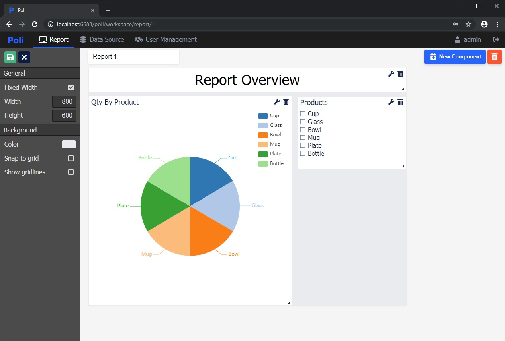
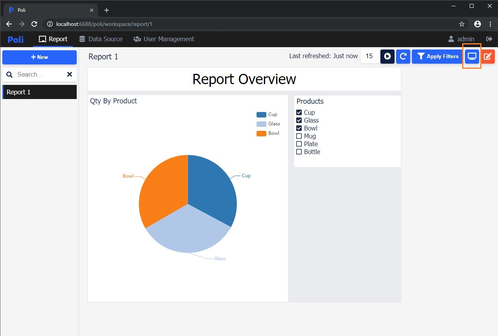
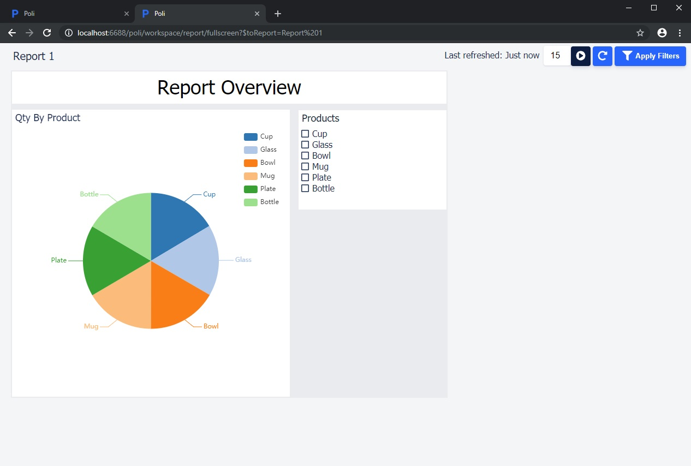
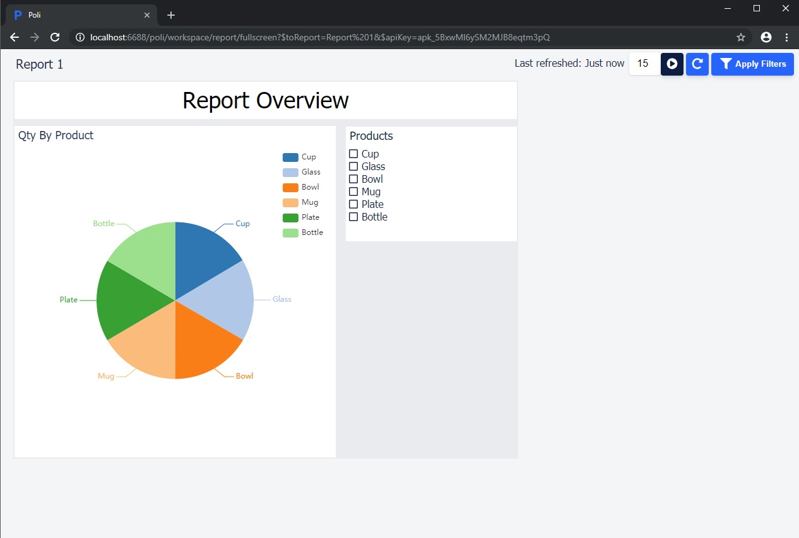
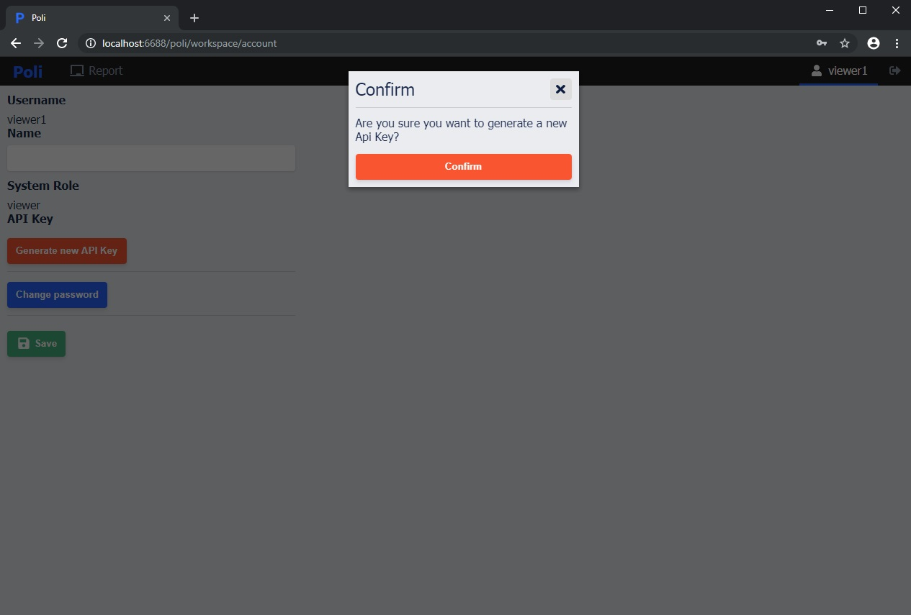
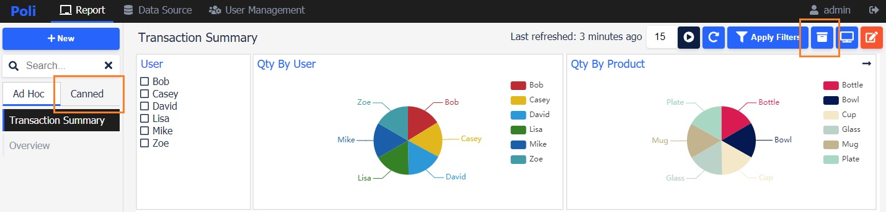

# Report

Reports are built with components in Poli that provide insights from the data through self-defined filtering options and visual representations. 

## Style customization


* Title
* Height
* Width
  
  > Fixed width vs full width: full width scales the components based on the screen width.
* Background color



## Auto refresh

Click the auto refresh button to enable report auto refresh. 

> The refresh rate is in seconds.


## Full screen

1. Click the full screen button.



2. The Report will be opened in a new browser tab in the full screen mode.



## Embedded

This mode allows the Report to be embedded into another application. The report data can be dynamically changed if dynamic queries are used to build the chart components. The query parameter can be passed by url search parameters. 



For example:
```html
<iframe src="http://localhost:6688/poli/workspace/report/fullscreen?$toReport=SalesReport$apiKey=ap_12345678&$showControl=true&year=2019"></iframe>
```

There are four url search parameters in this example.
    
* $toReport=SalesReport 

  Required. SalesReport is the report name.

* $apiKey=123

  Required. 123 is the api key. The api key can be obtained from the account page.

  

* year=2019

  Optional. Year is the query parameter. 2019 is the value. Any components that use :year parameter in the query will become reactive.

  For example:
  ```sql
  SELECT * FROM sales_transaction WHERE year = :year
  ```

* $showControl=true

  Optional. Whether to display the title bar with control panel.

## Canned report

Canned report captures a snapshot of the report, which perserves the current status of the filters and charts. 

The main push to use canned report is that the data in the source database might keep changing or be purged at some point. Sometimes if we need to save a copy of the data before it goes away, that's when canned report comes into play.

Save the report as canned report.



Notes
* Filters are not allowed to change values in canned report.
* Users can only create/view/delete canned report created by themselves.

